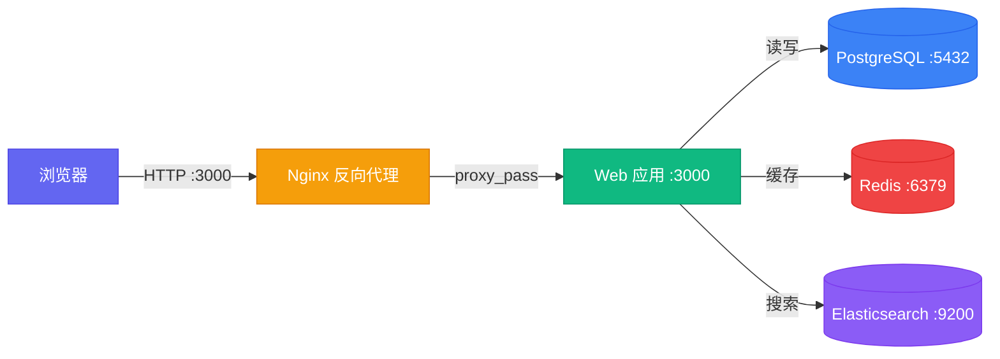
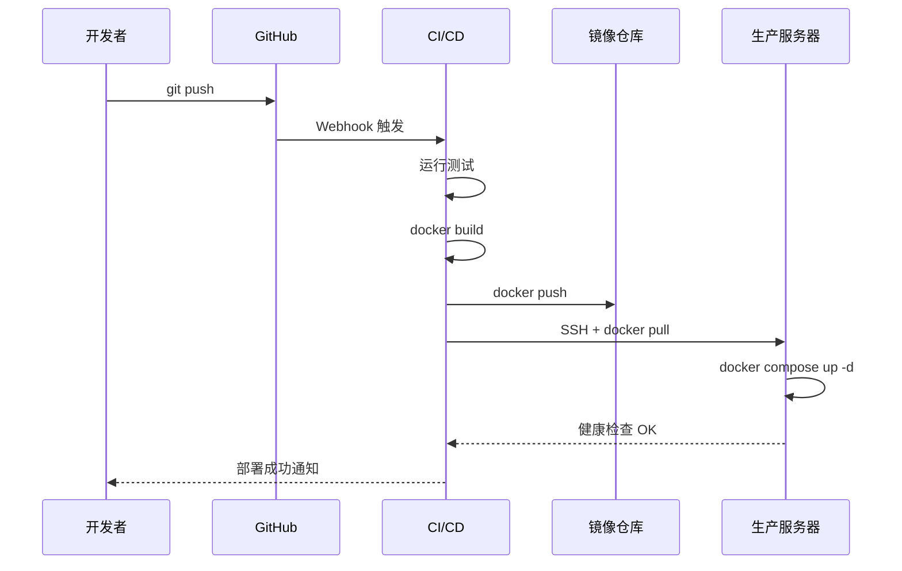

## 为什么用 Docker

"在我机器上能跑" 是开发者的经典痛点。Docker 把应用及其依赖打包进**容器**，确保在任何环境运行一致。

<div class="article-image">
  
  <figcaption>图：Docker 让应用与环境解耦</figcaption>
</div>

### 容器 vs 虚拟机

| 对比维度 | Docker 容器 | 虚拟机 |
|----------|------------|--------|
| 启动速度 | 秒级 | 分钟级 |
| 资源占用 | MB 级 | GB 级 |
| 隔离级别 | 进程级 | 硬件级 |
| 镜像大小 | 通常 < 100MB | 通常 > 1GB |
| 内核 | 共享宿主机内核 | 独立内核 |

## 一、编写第一个 Dockerfile

假设我们有一个简单的 Node.js 应用：

```javascript
// app.js
const express = require('express');
const app = express();
const PORT = process.env.PORT || 3000;

app.get('/', (req, res) => {
  res.json({ status: 'ok', uptime: process.uptime() });
});

app.listen(PORT, () => console.log(`Server running on :${PORT}`));
```

```json
{
  "name": "my-app",
  "dependencies": { "express": "^4.21.0" },
  "scripts": { "start": "node app.js" }
}
```

对应的 Dockerfile：

```dockerfile
# ---- 构建阶段 ----
FROM node:20-alpine AS builder
WORKDIR /app
COPY package*.json ./
RUN npm ci --omit=dev

# ---- 运行阶段 ----
FROM node:20-alpine
WORKDIR /app

# 创建非 root 用户
RUN addgroup -S appgroup && adduser -S appuser -G appgroup

# 从构建阶段复制依赖
COPY --from=builder /app/node_modules ./node_modules
COPY app.js ./

USER appuser
EXPOSE 3000

HEALTHCHECK --interval=30s --timeout=3s \
  CMD wget -qO- http://localhost:3000/ || exit 1

CMD ["node", "app.js"]
```

> 关键技巧：**多阶段构建**（multi-stage build）让最终镜像只包含运行时依赖，减小体积。

### 构建与运行

```bash
# 构建镜像
docker build -t my-app:latest .

# 查看镜像大小
docker images my-app

# 运行容器
docker run -d -p 3000:3000 --name my-app my-app:latest

# 查看日志
docker logs -f my-app

# 进入容器调试
docker exec -it my-app sh
```

## 二、Docker Compose 多服务编排

真实项目通常由多个服务组成（Web + 数据库 + 缓存）。Compose 用一个 YAML 文件描述整个技术栈。

### 架构图



### docker-compose.yml

```yaml
version: '3.9'
services:
  web:
    build: .
    ports:
      - '3000:3000'
    environment:
      DATABASE_URL: postgres://user:pass@db:5432/mydb
      REDIS_URL: redis://redis:6379
    depends_on:
      db:
        condition: service_healthy
      redis:
        condition: service_started
    volumes:
      - ./uploads:/app/uploads
    restart: unless-stopped

  db:
    image: postgres:16-alpine
    environment:
      POSTGRES_USER: user
      POSTGRES_PASSWORD: pass
      POSTGRES_DB: mydb
    volumes:
      - pgdata:/var/lib/postgresql/data
    healthcheck:
      test: ['CMD-SHELL', 'pg_isready -U user -d mydb']
      interval: 10s
      timeout: 5s
      retries: 5
    restart: unless-stopped

  redis:
    image: redis:7-alpine
    volumes:
      - redisdata:/data
    restart: unless-stopped

volumes:
  pgdata:
  redisdata:
```

```bash
# 一键启动所有服务
docker compose up -d

# 查看服务状态
docker compose ps

# 查看日志
docker compose logs -f web

# 执行一次性命令
docker compose run --rm web npm run migrate

# 停止并清理
docker compose down -v
```

## 三、镜像优化：让镜像瘦身 90%

```mermaid
gantt
    title 镜像优化前后体积对比
    dateFormat X
    axisFormat %s

    section 优化前
    基础 node:20 (1.1GB) :done, 0, 1100

    section 优化后
    alpine (150MB)  :done, 0, 150
    多阶段 (80MB)   :done, 0, 80
    distroless (50MB):done, 0, 50
```



### 优化技巧清单

```dockerfile
# ❌ 反面教材：一条命令一层，镜像臃肿
FROM node:20
RUN apt-get update
RUN apt-get install -y curl
RUN npm install -g pm2

# ✅ 优化版：合并 RUN、清理缓存
FROM node:20-alpine
RUN apk add --no-cache curl \
  && npm install -g pm2 \
  && rm -rf /root/.npm

# ✅ 使用 .dockerignore 排除不必要的文件
# node_modules
# .git
# *.md
# .env.local
```

## 四、常用命令速查

| 场景 | 命令 |
|------|------|
| 列出运行中的容器 | `docker ps` |
| 列出所有容器（含停止的） | `docker ps -a` |
| 停止容器 | `docker stop <name>` |
| 删除容器 | `docker rm <name>` |
| 删除镜像 | `docker rmi <image>` |
| 清理无用资源 | `docker system prune -a` |
| 查看容器资源占用 | `docker stats` |
| 查看镜像层历史 | `docker history <image>` |
| 复制文件到容器 | `docker cp file.txt container:/path/` |
| 导出镜像 | `docker save -o myapp.tar myapp:latest` |

## 五、生产环境部署流程



对应的 CI 配置片段（GitHub Actions）：

```yaml
# .github/workflows/deploy.yml 中的关键步骤
- name: Build and Push Docker image
  run: |
    docker build -t ghcr.io/${{ github.repository }}:${{ github.sha }} .
    echo "${{ secrets.GITHUB_TOKEN }}" | docker login ghcr.io -u ${{ github.actor }} --password-stdin
    docker push ghcr.io/${{ github.repository }}:${{ github.sha }}

- name: Deploy to server
  uses: appleboy/ssh-action@v1
  with:
    host: ${{ secrets.SERVER_HOST }}
    username: deploy
    key: ${{ secrets.SSH_KEY }}
    script: |
      docker pull ghcr.io/${{ github.repository }}:${{ github.sha }}
      cd /opt/app && docker compose up -d --no-deps web
```

## 总结

Docker 不是银弹，但它是现代开发的基础设施。掌握 Dockerfile + Compose 基本上覆盖了 80% 的使用场景：

1. **多阶段构建**减小镜像
2. **Docker Compose** 编排多服务
3. **健康检查**确保服务可用
4. **CI/CD 集成**实现自动部署

## 参考链接

- [Docker 官方文档](https://docs.docker.com/)
- [Dockerfile 最佳实践](https://docs.docker.com/develop/develop-images/dockerfile_best-practices/)
- [Compose 文件参考](https://docs.docker.com/compose/compose-file/)
- [Play with Docker](https://labs.play-with-docker.com/) — 在线 Docker 实验环境，无需本地安装
- [GoogleContainerTools/distroless](https://github.com/GoogleContainerTools/distroless) — 最小化容器镜像
