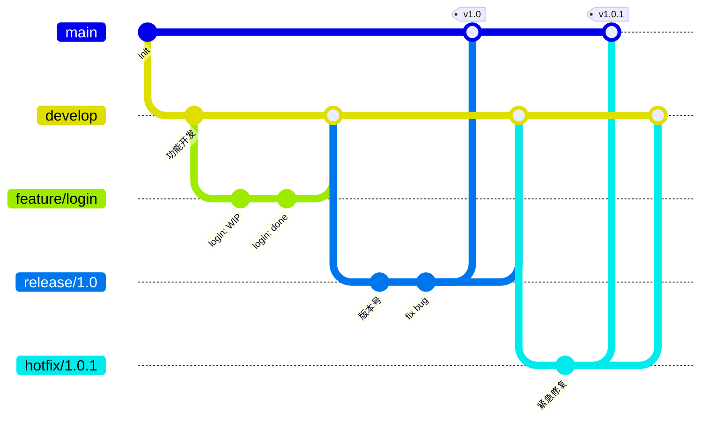
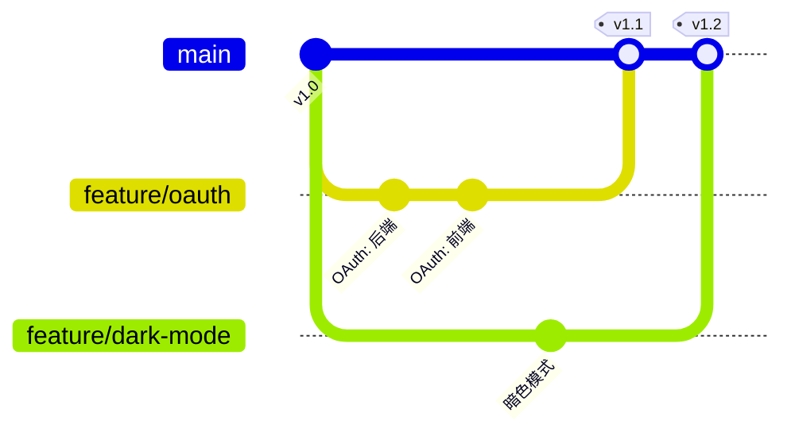
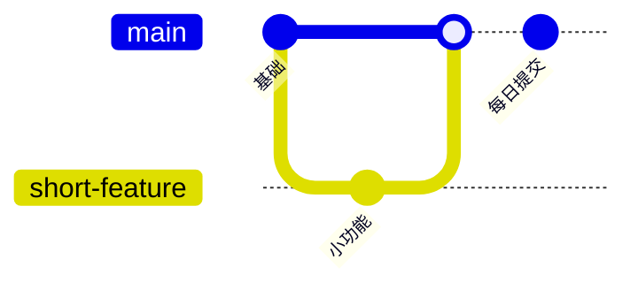
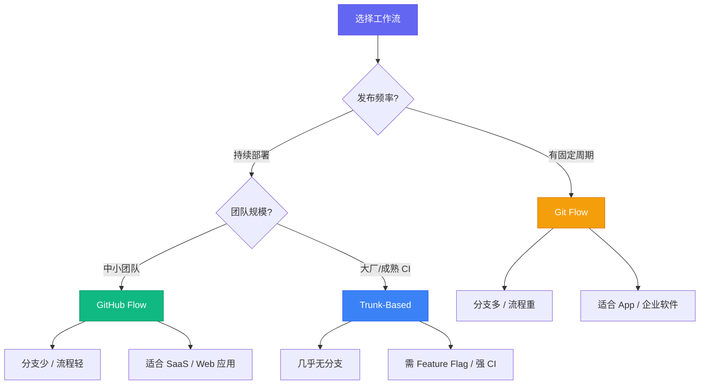

## 为什么需要 Git 工作流

Git 本身只是一个分布式版本控制系统，并没有规定你该怎么用它。没有工作流规范时，团队很容易出现以下问题：

- **合并地狱**：多人同时修改同一文件，冲突不断
- **发布混乱**：不知道哪个分支对应线上版本
- **回滚困难**：出问题时找不到干净的发布节点

> 好的工作流是**约定**，不是技术限制。它告诉团队"什么时候创建分支、什么时候合并、什么时候部署"。

下面逐一拆解三种主流工作流。

## 一、Git Flow —— 经典但重量级

Git Flow 由 Vincent Driessen 在 2010 年提出，定义了严格的分支模型。

### 分支全景



### 分支职责

| 分支 | 生命周期 | 命名 | 来源 | 合并到 |
|------|----------|------|------|--------|
| `main` | 永久 | `main` / `master` | — | — |
| `develop` | 永久 | `develop` | `main` | — |
| `feature/*` | 临时 | `feature/login` | `develop` | `develop` |
| `release/*` | 临时 | `release/1.0` | `develop` | `main` + `develop` |
| `hotfix/*` | 临时 | `hotfix/critical-bug` | `main` | `main` + `develop` |

### 常用命令

**创建 feature 分支：**

```bash
# 从 develop 切出新功能分支
git checkout -b feature/user-auth develop

# 开发完成后合并回 develop
git checkout develop
git merge --no-ff feature/user-auth
git branch -d feature/user-auth
```

**发布流程：**

```bash
# 创建 release 分支
git checkout -b release/1.2.0 develop

# 只做 bug 修复和文档更新
git commit -am "bump version to 1.2.0"

# 合并到 main 并打 tag
git checkout main
git merge --no-ff release/1.2.0
git tag -a v1.2.0 -m "Release 1.2.0"

# 同步回 develop
git checkout develop
git merge --no-ff release/1.2.0
git branch -d release/1.2.0
```

**紧急修复：**

```bash
git checkout -b hotfix/security-patch main
# 修复代码...
git commit -am "fix: patch security vulnerability"
git checkout main
git merge --no-ff hotfix/security-patch
git tag -a v1.2.1 -m "Hotfix 1.2.1"
git checkout develop
git merge --no-ff hotfix/security-patch
```

> **适用场景**：有明确发布周期的项目（如 App、企业软件）。不适用于持续部署。

## 二、GitHub Flow —— 轻量敏捷

GitHub Flow 的哲学是"**main 分支始终可部署**"。规则只有 6 条：

1. `main` 分支上的任何东西都是可部署的
2. 新工作从 `main` 创建描述性命名的分支
3. 定期推送到远程同名分支
4. 需要反馈时开 Pull Request
5. 代码审查通过后合并到 `main`
6. 合并后**立即部署**



### 工作流要点

```bash
# 1. 从 main 切分支
git checkout -b feat/add-search main

# 2. 开发并推送
git push -u origin feat/add-search

# 3. 开 PR、Code Review
# 在 GitHub/GitLab 上操作

# 4. 合并后本地同步
git checkout main
git pull origin main
git branch -d feat/add-search
```

> **适用场景**：持续部署项目、SaaS 服务、大多数现代 Web 应用。

## 三、Trunk-Based Development —— 主干开发

Google 和 Facebook 都在用的策略：**所有人直接往 `main`（trunk）提交，通过 Feature Flag 控制功能开关**。



### 核心实践

```bash
# 短生命周期分支（< 2 天）
git checkout -b tiny-fix main
# 修改少量代码...
git checkout main
git merge tiny-fix
git push origin main

# Feature Flag 控制（伪代码示例）
if (featureFlags.isEnabled('new-dashboard')) {
  renderNewDashboard();
} else {
  renderOldDashboard();
}
```

### 三种工作流对比



## 选择建议

| 场景 | 推荐工作流 | 理由 |
|------|-----------|------|
| 移动 App（有版本号） | Git Flow | 明确的 release 分支对应版本 |
| Web SaaS 服务 | GitHub Flow | 持续部署，main 即线上 |
| 开源项目 | GitHub Flow | PR + Code Review 天然支持 |
| 大型技术团队 | Trunk-Based | 减少合并冲突，高频集成 |
| 个人项目 | GitHub Flow | 够用且简单，不必过度设计 |

## 团队落地 Checklist

- [ ] 确定一种工作流并写成文档（放在仓库 `CONTRIBUTING.md`）
- [ ] 配置分支保护规则（`main` 禁止直接 push）
- [ ] 启用 CI 检查（lint / test / build）
- [ ] 要求至少 1 人 Code Review 后合并
- [ ] 统一 commit message 规范（[Conventional Commits](https://www.conventionalcommits.org/zh-hans/)）
- [ ] 定期回顾工作流是否仍然适合当前团队规模

> 没有银弹。工作流是为团队服务的，如果它开始拖慢你的节奏，就该调整了。

## 参考链接

- [A successful Git branching model](https://nvie.com/posts/a-successful-git-branching-model/) — Git Flow 原始文章
- [GitHub Flow](https://docs.github.com/en/get-started/using-github/github-flow) — GitHub 官方指南
- [Trunk Based Development](https://trunkbaseddevelopment.com/) — 详细介绍与案例
- [Conventional Commits](https://www.conventionalcommits.org/) — 提交信息规范
