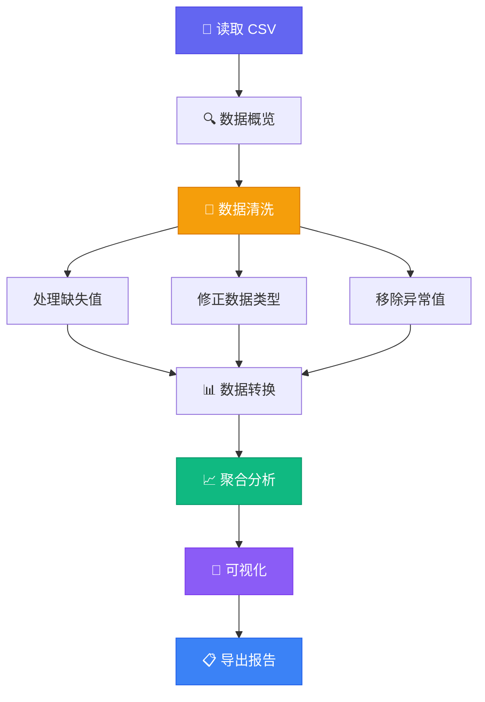

## 场景描述

假设你拿到了一份电商销售数据 `sales.csv`，老板想要一份"上季度各品类销售趋势"的报告。但数据很脏——缺失值、异常值、格式不统一。

本文带你走完**清洗 → 分析 → 可视化**的全流程。

<div class="article-image">
  
  <figcaption>图：数据处理与分析是数据驱动决策的基础</figcaption>
</div>

## 整体流程



## 环境准备

```bash
pip install pandas matplotlib numpy seaborn openpyxl
```

```python
import pandas as pd
import numpy as np
import matplotlib.pyplot as plt
import matplotlib.dates as mdates
import seaborn as sns

# 设置中文字体（避免图表中文乱码）
plt.rcParams['font.sans-serif'] = ['PingFang SC', 'Hiragino Sans GB', 'SimHei', 'Arial Unicode MS']
plt.rcParams['axes.unicode_minus'] = False

sns.set_style('whitegrid')
sns.set_palette('husl')
```

## 第一步：数据概览

```python
# 读取数据
df = pd.read_csv('sales.csv', parse_dates=['order_date'])

# 基本信息
print(f"形状: {df.shape}")
print(f"时间范围: {df['order_date'].min()} ~ {df['order_date'].max()}")
print(f"\n缺失值统计:")
print(df.isnull().sum())

print(f"\n数据类型:")
print(df.dtypes)

print(f"\n前 5 行:")
print(df.head())

print(f"\n数值列统计:")
print(df.describe())
```

典型输出：

```text
形状: (12500, 8)
时间范围: 2026-01-01 00:00:00 ~ 2026-06-30 00:00:00

缺失值统计:
order_id           0
order_date         0
product_name      12
category           5
quantity          38
unit_price        42
total_amount      45
customer_city     89

数据类型:
order_id          object
order_date        datetime64[ns]
product_name      object
category          object
quantity          float64
unit_price        float64
total_amount      float64
customer_city     object
```

## 第二步：数据清洗

### 2.1 处理缺失值

```python
def clean_data(df: pd.DataFrame) -> pd.DataFrame:
    """清洗销售数据集"""
    # 复制避免污染原始数据
    df = df.copy()

    # 1. 删除关键列为空的记录
    df = df.dropna(subset=['order_date', 'total_amount'])

    # 2. 数值列用中位数填充（比均值更抗异常值）
    num_cols = ['quantity', 'unit_price', 'total_amount']
    for col in num_cols:
        df[col] = df[col].fillna(df[col].median())

    # 3. 分类列用"未知"填充
    cat_cols = ['product_name', 'category', 'customer_city']
    for col in cat_cols:
        df[col] = df[col].fillna('未知')

    return df

df = clean_data(df)
print(f"清洗后缺失值: {df.isnull().sum().sum()}")
```

### 2.2 修正数据类型与异常值

```python
# 确保数值类型
df['quantity'] = pd.to_numeric(df['quantity'], errors='coerce').astype(int)
df['unit_price'] = pd.to_numeric(df['unit_price'], errors='coerce').round(2)
df['total_amount'] = pd.to_numeric(df['total_amount'], errors='coerce').round(2)

# 异常值过滤：数量 > 0 且 单价在合理范围
mask_quantity = df['quantity'].between(1, 1000)
mask_price = df['unit_price'].between(0.01, 99999)
df = df[mask_quantity & mask_price]

# 移除 total_amount 与 quantity * unit_price 偏差过大的记录
df['calculated_total'] = (df['quantity'] * df['unit_price']).round(2)
deviation = abs(df['total_amount'] - df['calculated_total']) / df['total_amount']
df = df[deviation < 0.01]  # 偏差超过 1% 的记录丢弃

# 添加衍生列
df['month'] = df['order_date'].dt.to_period('M')
df['day_of_week'] = df['order_date'].dt.day_name()
df['is_weekend'] = df['order_date'].dt.dayofweek >= 5

print(f"清洗后记录数: {len(df)}")
```

### 2.3 验证数据质量

```python
def validate_data(df: pd.DataFrame) -> dict:
    """返回数据质量报告"""
    return {
        '总行数': len(df),
        '总列数': len(df.columns),
        '缺失值总数': df.isnull().sum().sum(),
        '品类数': df['category'].nunique(),
        '城市数': df['customer_city'].nunique(),
        '日期范围': f"{df['order_date'].min():%Y-%m-%d} ~ {df['order_date'].max():%Y-%m-%d}",
        '平均订单金额': round(df['total_amount'].mean(), 2),
        '金额中位数': round(df['total_amount'].median(), 2),
    }

quality = validate_data(df)
for k, v in quality.items():
    print(f"  {k}: {v}")
```

## 第三步：数据分析

### 3.1 按品类与月份聚合

```python
# 核心聚合：品类 × 月份的销售额趋势
monthly_sales = (
    df.groupby(['category', 'month'])
    .agg(
        total_revenue=('total_amount', 'sum'),
        order_count=('order_id', 'count'),
        avg_order_value=('total_amount', 'mean'),
    )
    .reset_index()
)

# 转为字符串方便后续处理
monthly_sales['month'] = monthly_sales['month'].astype(str)

print(monthly_sales.head(10))
```

### 3.2 找出高价值品类

```python
# Top 5 品类（按总销售额）
top_categories = (
    df.groupby('category')['total_amount']
    .sum()
    .sort_values(ascending=False)
    .head(5)
)

print("🏆 Top 5 品类:")
for rank, (cat, rev) in enumerate(top_categories.items(), 1):
    print(f"  #{rank} {cat}: ¥{rev:,.2f}")
```

### 3.3 数据透视表

```python
# 数据透视表：品类 × 月份 × 销售额
pivot = monthly_sales.pivot_table(
    values='total_revenue',
    index='category',
    columns='month',
    aggfunc='sum',
    fill_value=0,
)

print("📊 销售额透视表（品类 × 月份）:")
print(pivot.to_string(float_format='¥{:,.0f}'))
```

## 第四步：数据可视化

### 4.1 品类销售趋势

```python
fig, axes = plt.subplots(2, 2, figsize=(16, 12))
fig.suptitle('2026年H1 销售数据分析报告', fontsize=18, fontweight='bold', y=0.98)

# 图1：月度总销售额折线图
ax1 = axes[0, 0]
monthly_total = df.groupby('month')['total_amount'].sum()
months = monthly_total.index.astype(str)
ax1.fill_between(range(len(months)), monthly_total.values / 10000, alpha=0.3, color='#6366f1')
ax1.plot(range(len(months)), monthly_total.values / 10000, marker='o', color='#6366f1', linewidth=2)
for i, v in enumerate(monthly_total.values / 10000):
    ax1.text(i, v + 0.5, f'{v:.1f}万', ha='center', fontsize=9)
ax1.set_title('月度总销售额趋势')
ax1.set_ylabel('销售额 (万元)')
ax1.set_xticks(range(len(months)))
ax1.set_xticklabels(months, rotation=45)

# 图2：Top 5 品类柱状图
ax2 = axes[0, 1]
colors = ['#6366f1', '#8b5cf6', '#a78bfa', '#c4b5fd', '#ddd6fe']
bars = ax2.barh(top_categories.index, top_categories.values / 10000, color=colors)
for bar, v in zip(bars, top_categories.values / 10000):
    ax2.text(bar.get_width() + 0.3, bar.get_y() + bar.get_height()/2, f'{v:.1f}万', va='center')
ax2.set_title('Top 5 品类销售额')
ax2.invert_yaxis()

# 图3：各品类月度趋势
ax3 = axes[1, 0]
for cat in top_categories.index[:3]:
    cat_data = monthly_sales[monthly_sales['category'] == cat]
    months_order = sorted(monthly_sales['month'].unique())
    cat_data = cat_data.set_index('month').reindex(months_order).fillna(0)
    ax3.plot(months_order, cat_data['total_revenue'].values / 10000, marker='o', label=cat, linewidth=2)
ax3.set_title('Top 3 品类月度趋势')
ax3.set_ylabel('销售额 (万元)')
ax3.legend()
ax3.tick_params(axis='x', rotation=45)

# 图4：客单价分布
ax4 = axes[1, 1]
# 过滤极端值使图表更清晰
avgs = df.groupby('category')['total_amount'].mean().sort_values()
avgs.plot(kind='barh', ax=ax4, color='#10b981')
ax4.set_title('各品类平均客单价')
ax4.set_xlabel('平均客单价 (元)')

plt.tight_layout()
plt.savefig('sales_report.png', dpi=150, bbox_inches='tight')
plt.show()
```

### 4.2 单品类深度分析

```python
def category_deep_dive(category: str):
    """单品类深度分析"""
    cat_df = df[df['category'] == category]

    fig, axes = plt.subplots(1, 3, figsize=(18, 5))
    fig.suptitle(f'🔍 {category} 品类深度分析', fontsize=16)

    # 左：周分布
    weekday_order = ['Monday','Tuesday','Wednesday','Thursday','Friday','Saturday','Sunday']
    weekday_sales = cat_df.groupby('day_of_week')['total_amount'].sum()
    weekday_sales = weekday_sales.reindex(weekday_order).fillna(0)
    axes[0].bar(weekday_sales.index, weekday_sales.values / 10000, color='#6366f1')
    axes[0].set_title('周几卖得最好?')
    axes[0].set_ylabel('销售额 (万元)')
    axes[0].tick_params(axis='x', rotation=45)

    # 中：Top 10 城市
    city_sales = cat_df.groupby('customer_city')['total_amount'].sum().nlargest(10)
    axes[1].barh(city_sales.index, city_sales.values / 10000, color='#10b981')
    axes[1].set_title('Top 10 购买城市')
    axes[1].invert_yaxis()

    # 右：客单价分布直方图
    prices = cat_df[cat_df['total_amount'] < cat_df['total_amount'].quantile(0.95)]
    axes[2].hist(prices['total_amount'], bins=40, color='#f59e0b', edgecolor='white', alpha=0.8)
    axes[2].axvline(cat_df['total_amount'].median(), color='red', linestyle='--', label=f'中位数 ¥{cat_df["total_amount"].median():.0f}')
    axes[2].set_title('客单价分布')
    axes[2].set_xlabel('金额 (元)')
    axes[2].legend()

    plt.tight_layout()
    plt.show()

    return {
        '总销售额': f"¥{cat_df['total_amount'].sum():,.0f}",
        '订单数': len(cat_df),
        '平均客单价': f"¥{cat_df['total_amount'].mean():,.2f}",
        '最高客单价': f"¥{cat_df['total_amount'].max():,.2f}",
    }

stats = category_deep_dive('电子产品')
for k, v in stats.items():
    print(f"  {k}: {v}")
```

## 第五步：导出结果

```python
# 1. 导出清洗后的数据
df.to_csv('sales_cleaned.csv', index=False, encoding='utf-8-sig')

# 2. 导出 Excel 报告（多个 sheet）
with pd.ExcelWriter('sales_summary.xlsx', engine='openpyxl') as writer:
    monthly_sales.to_excel(writer, sheet_name='月度汇总', index=False)
    pivot.to_excel(writer, sheet_name='数据透视表')
    # 汇总统计
    summary = pd.DataFrame({
        '指标': ['总销售额', '总订单数', '平均客单价', '品类数', '数据起始', '数据截止'],
        '值': [
            f"¥{df['total_amount'].sum():,.0f}",
            len(df),
            f"¥{df['total_amount'].mean():,.2f}",
            df['category'].nunique(),
            df['order_date'].min().strftime('%Y-%m-%d'),
            df['order_date'].max().strftime('%Y-%m-%d'),
        ]
    })
    summary.to_excel(writer, sheet_name='概览', index=False)

print("✅ 报告已导出: sales_cleaned.csv + sales_summary.xlsx")
```

## 关键技巧总结

| 步骤 | 关键函数 | 常见坑 |
|------|---------|--------|
| 读取 | `pd.read_csv(parse_dates=...)` | 忘记解析日期，后续分析受限 |
| 清洗 | `fillna()` / `dropna()` / `between()` | 用均值填充时被异常值拉偏 |
| 聚合 | `groupby().agg()` | 聚合后索引变为 MultiIndex |
| 透视 | `pivot_table()` | 行列层级理解容易混淆 |
| 可视化 | `matplotlib` + `seaborn` | 中文乱码、负号显示为方块 |

## 完整代码获取

```bash
# 克隆示例仓库
git clone https://github.com/example/python-data-analysis.git
cd python-data-analysis

# 安装依赖
pip install -r requirements.txt

# 运行完整分析
python analyze.py --input sales.csv --output ./report/
```

## 参考链接

- [Pandas 官方文档](https://pandas.pydata.org/docs/) — 数据处理核心库
- [Matplotlib 中文指南](https://wizardforcel.gitbooks.io/matplotlib-user-guide/content/) — 图表绘制
- [Seaborn 教程](https://seaborn.pydata.org/tutorial.html) — 统计可视化
- [Python 数据科学手册](https://jakevdp.github.io/PythonDataScienceHandbook/) — 经典免费资源
- [10 Minutes to pandas](https://pandas.pydata.org/docs/user_guide/10min.html) — 快速入门
